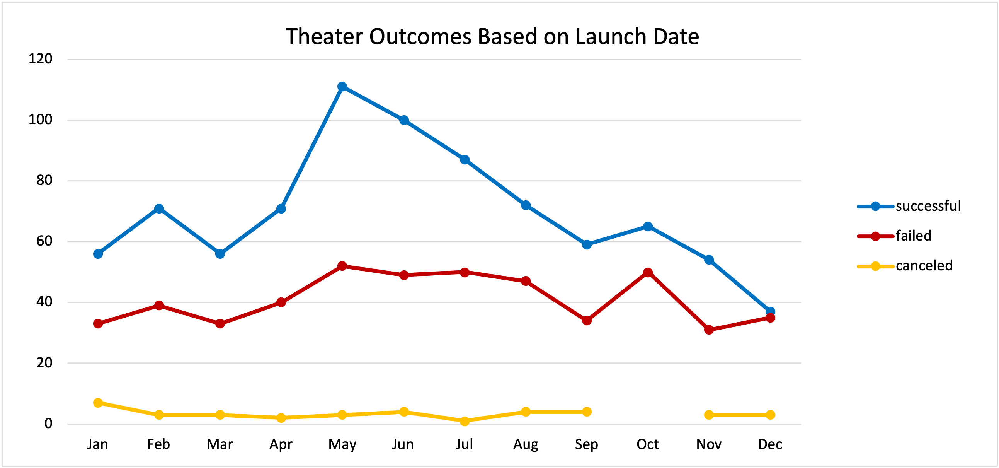
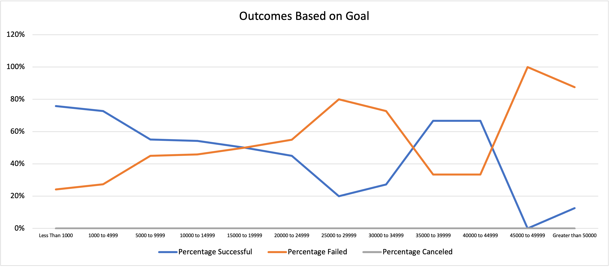

# Kickstarter-Analysis
Performing analysis on Kickstarter data to uncover trends using Microsoft Excel
## Overview of Project

### Purpose
Louise, a playwright, had little time to raise funds on Kickstarter for her play *Fever* with an estimated budget of roughly $10,000. Louise was able to nearly reach her goal and with this, she wanted to know the outcomes of Kickstarter campaigns based on their launch dates and funding goals. Crowdfunding data was used to identify and determine trends/factors for a successful campaign using Microsoft Excel.
 
:grey_exclamation: Refer to the [Kickstarter_Challenge.xlsx.zip](https://github.com/samanthajpv/Kickstarter-Analysis/blob/3d390f557771a478f95b7318b261218a7247828b/Kickstarter_Challenge.xlsx.zip) for *spreadsheet*.

## Analysis and Challenges 

### Analysis of Outcomes Based on Launch Date
A pivot table was created to show the number of outcomes (successful, failed, and canceled) with the parent category 'theater' and years '2009-2017' as filter (refer to tab 'Theater Outcomes by Launch Date' in the *spreadsheet*). The count of outcomes are displayed per month and a pivot line chart was created for visualization.
  
The month with the highest successful theater outcome based on launch date was May, with over 100 campaigns. It can also be seen that June and July did well. The rest were in the same range of about 50 to a little over 70 successful campaigns, except for December which had almost the same number of successful and failed campaigns of almost 40. The number of canceled campaigns were not significant but the number of failed campaigns were approximately 30-50 every month.

### Analysis of Outcomes Based on Goals
With the use of COUNTIFS() formula, a table was created to account for the funding goals in ranges and the number of outcomes. The percentage of each outcome was then calculated based on the total for each range and was used for the line chart.

The chart shows that in the first 8 ranges, the percentage of successful campaigns decreases as the goal increases, while the percentage of failed campaigns increases as the goal increases. The graph then goes a bit erratic and upon further analysis, it shows that there are much less number of plays with higher goal funding. For ranges $35,000 to $45,000, there are only 9 campaigns with 6 successful ones (refer to tab 'Outcomes Based on Goals' in the *spreadsheet*). This will result to a 67% success rate, hence the increase in the line chart. Comparing it to the number of campaigns with goals less than $15,000, there were hundreds. But as seen on the right hand side of the chart, percetage failed is still greater than the percentage of successful campaigns.

### Challenges and Difficulties Encountered
The first challenge was to examine the data and make sure that all details are readable. One must be able to identify that two columns were in Unix timestamps and these were converted to datetime format. Another challenge encountered was identifying the correct data to be used. There was additional splitting of cells that was needed in order to get the subcategory and only focus on data from theater and plays. These are steps that can easily be overlooked and can greatly affect the outcome of the analysis.

## Results

- What are two conclusions you can draw about the Outcomes based on Launch Date?

May has the most number of successful campaigns relative to the number of failed outcomes. Looking at the months of May to August and October, they roughly have the same number of failed campaigns which makes May the month that has the highest chance of success rate for a launch date. Also, one must note that May has the highest number of campaigns while December has the least number of campaigns overall.

- What can you conclude about the Outcomes based on Goals?

For outcomes based on goals, the higher the goal is, the lower the chances of the campaign to be successful. There are also a huge difference in number of campaigns as the funding goal increases.

- What are some limitations of this dataset?

One limitation of the dataset is the use of different currencies. There was no standardization of currency for the analysis of outcomes based on goals. Also, it would have been preferable to narrow down the analysis to a specific area. An example would be the country where the playwright, Louise, is going to gauge the result of her campaign to or at least in the areas of interest.

- What are some other possible tables and/or graphs that we could create?

An additional analysis could be analyzing the length of the campaigns and comparing it to the number of outcomes. This would help in determining whether or not there is an ideal length of campaign that would make the fundraising event a successful one. 

Also, the actual amount pledged for the campaigns could have been helpful in solidifying the trends that were determined, not to mention the fact that that information is already at hand. Creating a box and whisker plot would help in determining outliers and comparing funding goals versus the pledged amounts will be easier. The box plot will calculate the mean, median, quartiles, and the range of the data which can help in determining the ideal funding goal.

## Reference

(1) Trilogy Education Services. (2021, June). *Module 1 Challenge*. https://courses.bootcampspot.com/courses/626/assignments/13309?module_item_id=211540
